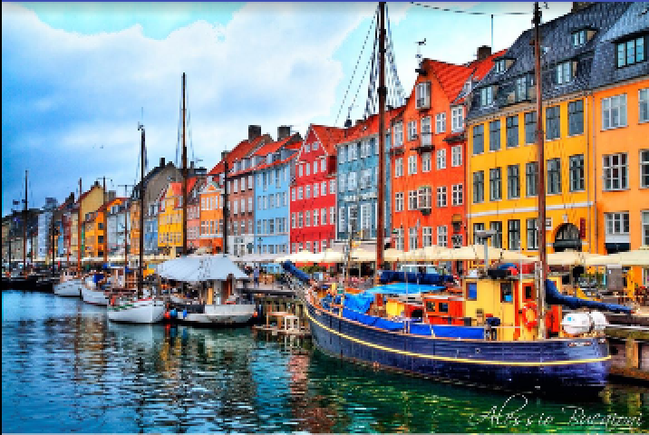
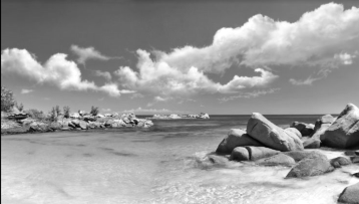
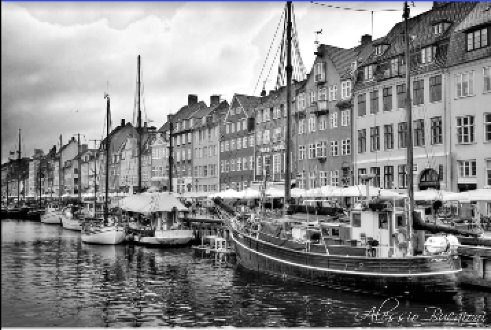
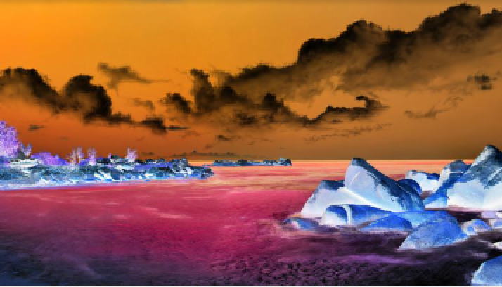
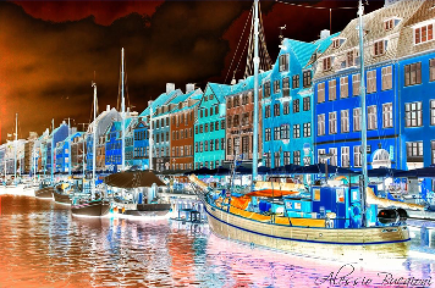
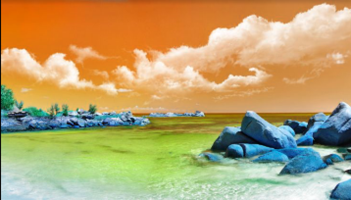
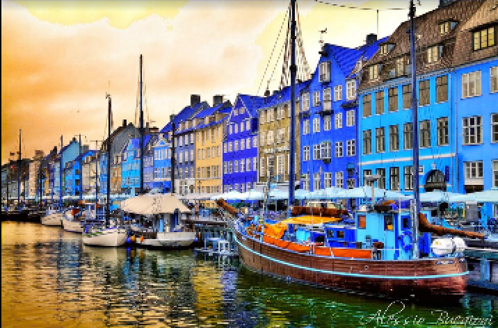

# StyleImageView

## Introduction

This library can set the style of ImageView/View background/Drawable/Bitmap and also brightness & contrast. This library now supports 10 different styles, you can check them out below. You can enable animation, and choose to set Interpolators and Listeners. You can acquire the Bitmap of ImageView/View/Drawable after style is set.

If you only need to operate ImageViews, you can use the StyleImageView class. You can specify attributes from layout file. If you are already using custom ImageViews, or you want to operate on View's background, or any Drawable or Bitmap, you can use the Styler class.

**Note that this library uses ColorFilter to achieve effects. If you are using ColorFilter in your project, this may cause conflicts.**

## Try Sample

## Feature

StyleImageView supports 10 styles as follow. Note that you can set brightness and contrast on top of them. Example of Saturation mode is not listed, since this mode needs a saturation input.

| Modes           | Sea Shore | Boat and Houses |
| --------------- | --------- | --------------- |
| Original        |  |  |
| Grey Scale      |  |  |
| Invert          |  |  |
| RGB to BGR      |  |  |